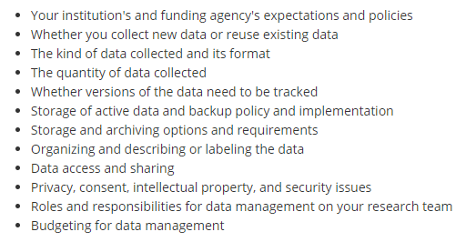

Research data management involves the planning, documentation, organization, storage, and dissemination of your research study data. Successful data management allows your research to be replicable, interpretable, secure, and usable while poor data management can lead to erroneous conclusions, unusable or even lost data, and security issues. Consequently, data management is an ethical issue. The replication crisis is just one example of a failure to include good data management practices in research, resulting for example, in one study finding that across 100 replicated experiments from three psychology journals, only 36% of statistically significant findings could be replicated [(Open Science Collaboration, 2015)](https://science.sciencemag.org/content/349/6251/aac4716).

Data management includes these broad concepts:

* Documentation
* Standardization (of file names, variable names, file paths)
* Data collection planning
* Data tracking
* Data storage
* Data processing and preservation, including documenting what [Teague Henry](https://www.teaguehenry.com/strings-not-factors/2021/2/21/eight-principles-of-good-data-management) refers to as the chain of processing
* Data sharing
* Analysis (we will not cover analysis in this series, however, many of the data management concepts covered in this training are applicable during analysis as well)

And generally follows this data life cycle:

```{r, echo=FALSE, fig.align="center", out.width='50%'}

knitr::include_graphics("img/data-lifecycle.jpg")

```

Source: [Nayang Technological University](https://blogs.ntu.edu.sg/lib-datamanagement/data-lifecycle/)

---

## Framework

---

### FAIR

In 2016, the [FAIR Principles](https://www.go-fair.org/fair-principles/) were published in Scientific Data, outlining 4 guiding principles for scientific data management and stewardship. Those principles are:

F: Findable

All data should be findable through good data documentation, aka metadata. As we move towards automation in our work and life, the need for machine-readable metadata becomes more prevalent for automatic discovery of data.

A: Accessible

You data is accessible if humans can access your data. This can mean your data is available in a repository or through a request system. 

I: Interoperable

Both humans and machines should be able to read and interpret your data. Software licenses should not pose a barrier to usage. Data should be available in open formats that can be accessed by any software such as .csv, .txt, .dat, etc. Furthermore, thorough data documentation should accompany data to allow that data to interoperable.

R: Reusable

Your metadata should provide information on the broad context of your project as well as your data collection to allow for accurate use of your data.

Additional resources:

📑 [Within & Between podcast](https://podcasts.apple.com/us/podcast/episode-4-the-what-why-how-and-hesitations-of-data-sharing/id1517310439?i=1000483521281)

### SEER

In addition to the FAIR principles, the [SEER principles](https://ies.ed.gov/seer/index.asp), developed in 2018 by Institute of Education Sciences (IES), provide Standards in Excellence in Education Research. While the principles broadly cover the entire life cycle of a research study, they provide context for good data management within an education research study. The SEER principles include:

* Pre-register studies
* Make findings, methods, and data open
* Identify interventions' core components
* Document treatment implementation and contrast
* Analyze interventions' costs
* Focus on meaningful outcomes
* Facilitate generalization of study findings
* Support scaling of promising results

### Open Science

The concept of Open Science has pushed quality data management to the forefront, bringing visibility to its cause, as well as advances in practices and urgency to implement them. Open Science aims to make scientific research and dissemination accessible for all, making the need for good data management practices absolutely necessary. Open science advocates for open data, open analysis, open materials, preregistration, and open access ([van Dijk, W., Schatschneider, C., & Hart, S. A., 2020](https://edarxiv.org/qdj4t/)). Organizations such as the [Center for Open Science](https://www.cos.io/), have become a well-known proponents of open science, offering the open science framework [(OSF)](https://www.ncbi.nlm.nih.gov/pmc/articles/PMC5370619/), as a tool to promote open science through the entire research life cycle. Furthermore, many education funders such as NIH, NSF, and IES have aligned their fundee requirements with these open science practices, such as the practice of pre-registration mentioned above in the SEER principles.

---
  
## Data Management Plan

---
  
Outside of practical and principled reasons to want to improve your data management, funding institutions require a certain level of data management for their funded projects. For example, to increase transparency and to advance scientific inquiry in education research, ([IES](https://ies.ed.gov/funding/datasharing_implementation.asp)) has a policy on providing access to your data at the conclusion of projects funded through their research centers (*Exploration* or *Initial Efficacy and Follow-Up* grants). The plan for sharing data must be laid out in a data management plan (DMP) which is included as an appendix in your grant application. Among other things, the DMP must include the following:  
  
✔️ Type of data to be shared  
✔️ Procedures for managing and maintaining confidentiality  
✔️ Roles and responsibilities of project staff in the management of research data  
✔️ Expected schedule for data sharing (no later than the publication of findings and at least for 10 years)  
✔️ Format of the final dataset  
✔️ Documentation to be provided  
✔️ Method of data sharing (Share the data yourself, use a data archive, combination of both)  
✔️ Whether or not a data sharing agreement specifies the conditions under which the data will be shared  
✔️ Any circumstances that prevent any data from being shared  
✔️ Most recent rule: A plan for [pre-registering](https://ies.ed.gov/seer/preregistration.asp) your study within the first year of the project  

Pre-registration is just one part of the Department of Education's effort an effort to align research with the [SEER](https://ies.ed.gov/seer/index.asp) and [FAIR](https://www.go-fair.org/fair-principles/) data governance principles. 

In addition to IES, many other funders that education researchers may work with require a DMP (ex: [NIJ](https://nij.ojp.gov/funding/research-development-and-evaluation-grant-award-requirements#vj8jg), [NSF](https://www.nsf.gov/bfa/dias/policy/dmp.jsp), and [NIH](https://grants.nih.gov/grants/policy/data_sharing/data_sharing_guidance.htm#doc)). This training will not cover the details of writing up a DMP but rather how to implement a DMP. 

Here are some excellent resources for writing up a DMP:

  📑 [University of Virginia IES DMP   template](https://data.library.virginia.edu/files/IES-Data-Management-Plan-Template-2018.docx)  
  📑 [IES DMP tool](https://dmptool.org/template_export/1895.pdf)  
  📑 [IES most recent Request for Applications](https://ies.ed.gov/funding/pdf/2021_84305A.pdf)  
  📑 [Foundational Practices of Research Data Management](https://riojournal.com/article/56508/instance/5569679/)  
  📑 [Sara Hart template](https://figshare.com/articles/preprint/Example_of_a_Data_Management_Plan/13218743/1)
  
---

## Terminology/vocabulary

---

Before diving into the content of this training, I think it is helpful to cover terminology that will be used in these modules. Many concepts in education research have multiple terms and can be used interchangeably (other terms are listed in brackets). Across different institutions, researchers may use all or some of these terms.

**Unique identifier (UID)**: This is a numeric or alphanumeric identifier that is unique to every participant, site or object.  

**Participant ID**: [study ID, subject ID, participant code, record id, unique id] In longitudinal studies, these identifiers allow us to link data across time.  

**Condition**: [treatment, intervention status]  

**Site ID**: [location ID]  

**Cohort**:  

**Wave**: [time period, event]  

**Tracking**: [roster, demographic file, master list, master key] (sometimes called a master list because it contains data that links your assigned study IDs to their identifiable information)  

**Variable**: [column, field]  

**Variable name**: [header] 

**Subject**: [case, row, participant, record]  

**Directory**:  

**Path**:

**Randomization block**: 

**Study**:  

**Data**: "Data are items of recorded information considered collectively for reference or analysis" ([University of Pittsburgh](https://pitt.libguides.com/managedata/understanding)). It can include, but is not limited to survey responses, measurements, assessments, recordings, code, transcripts, and statistics.  

**Dataset**: [dataframe, spreadsheet] 

**Raw data**: [untouched]  

**Clean data**: [processed data]  

**Database**:

**Standardization**:  

**PII**:   

**Missing**: [NULL, NA] 

**Anonymous**:  

**Confidential**:  


---

## Considerations

---

Good data management requires a lot of thought and planning. The [University of Pittsburgh](https://pitt.libguides.com/managedata/understanding) has an excellent list of 12 things to consider in your data management planning.

```{r, echo=FALSE, out.width='60%'}



```


---

## Resources

---

As I have been working on this training I have found there are some excellent existing resources out there as well as others who are doing similar work, even in the field of education. Below are some of the resources I highly recommend.

1. Academic Research Librarians
    + Almost every academic institution employs research data librarians whose job is to help faculty and staff with research data services. This is a great resource to utilize if you work at a university.
Examples:
    + [Research Data Management at University of Pittsburgh](https://pitt.libguides.com/managedata)
    + [Washington University Data Services Team](https://library.wustl.edu/research-support/data-services/)
    + [Data at Reed](https://www.reed.edu/data-at-reed/index.html)

2. A team at Florida State University (including Christopher Schatschneider, Tara Reynolds, Sara Hart and colleagues) have been putting out tons of resources around data management, specifically in education, and open science practices in general. 
      + [The Basic of Data Management](https://docs.google.com/document/d/1GfIo67-wqq-26ZG9etar5tiKKYLLqWCra8jySolAK7Y/edit)
      + [Open Science in Education Sciences](https://edarxiv.org/qdj4t/)
      + [Data Sharing in Education Science](https://edarxiv.org/2x3cu)

3. Teague Henry, a postdoctoral fellow in the Department of Psychiatry at the University of Pittsburgh, has been putting out blog posts around data management and they have be very insightful.
    + [Eight Principles of Good Data Management](https://www.teaguehenry.com/strings-not-factors/2021/2/21/eight-principles-of-good-data-management)
    + [Data Management for Researchers: Three Tales](https://www.teaguehenry.com/strings-not-factors/2021/1/24/data-management-for-researchers-three-terrifying-tales)

4. Open Science Foundation has endless slide decks covering data management and open science concepts.
    + Simply go to https://osf.io/ and type "data management slides" into the search box and you will get over 1 million results!

5. Kristin Briney, a librarian at CalTech, wrote the book [Data Management for Researchers](http://dataabinitio.com/?author=1), and also has a [blog](http://dataabinitio.com/) where she frequently posts about data management topics and issues.

