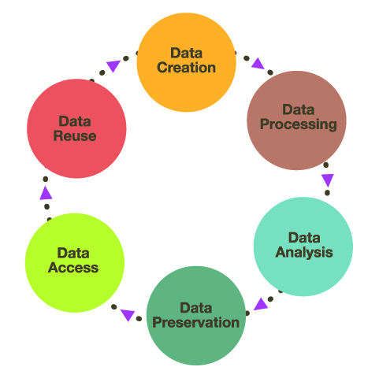
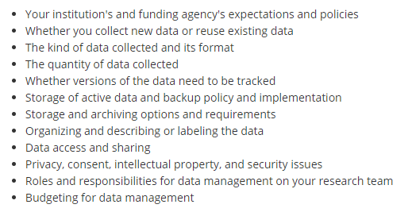

Research data management involves the planning, documentation, organization, storage, and dissemination of research study data. A plan for data management should be developed before a project ever starts and that plan should be implemented alongside all research study activities through out the entire project life cycle. Successful data management upholds research integrity ([UMASS](https://library.umassmed.edu/resources/necdmc/modules)), and allows research to be replicable, interpretable, secure, and usable while poor data management can lead to erroneous conclusions, unusable or even lost data, and security issues. Consequently, data management is an ethical issue. The replication crisis is just one example of a failure to include good data management practices in research, resulting for example, in one study finding that across 100 replicated experiments from three psychology journals, only 36% of statistically significant findings could be replicated [(Open Science Collaboration, 2015)](https://science.sciencemag.org/content/349/6251/aac4716).

Data management includes these broad concepts:

* Documentation
* Standardization (of file names, variable names, file paths)
* Data collection planning
* Participant and data tracking
* Data storage and security
* Data processing and preservation, including documenting what [Teague Henry](https://www.teaguehenry.com/strings-not-factors/2021/2/21/eight-principles-of-good-data-management) refers to as the chain of processing
* Data sharing
* Analysis (we will not cover analysis in this series, however, many of the data management concepts covered in this training are applicable during analysis as well)

And generally follows this data life cycle:

```{r, echo=FALSE, fig.align="center", out.width='50%'}



```

Source: [Nayang Technological University](https://blogs.ntu.edu.sg/lib-datamanagement/data-lifecycle/)

---

## Framework

---

### FAIR

In 2016, the [FAIR Principles](https://www.go-fair.org/fair-principles/) were published in Scientific Data, outlining 4 guiding principles for scientific data management and stewardship. Those principles are:

F: Findable

All data should be findable through a persistent identifier and have good data documentation, aka metadata. As we move towards automation in our work and life, the need for machine-readable metadata becomes more prevalent for automatic discovery of data.

A: Accessible

You data is accessible if humans can access your data. This can mean your data is available in a repository or through a request system. 

I: Interoperable

Use standardized vocabularies as well as formats. Both humans and machines should be able to read and interpret your data. Software licenses should not pose a barrier to usage. Data should be available in open formats that can be accessed by any software such as .csv, .txt, .dat, etc. Furthermore, thorough data documentation should accompany data to allow that data to interoperable.

R: Reusable

Your metadata should provide information on the broad context of your project as well as your data collection to allow for accurate use of your data. You should also have clear licensing for data use. 

Additional resources:

  📑 [Within & Between podcast](https://podcasts.apple.com/us/podcast/episode-4-the-what-why-how-and-hesitations-of-data-sharing/id1517310439?i=1000483521281)  
  📑 [Jessica Rex slides](https://zenodo.org/record/3534954#.YFIxBZ1KiUk)


### SEER

In addition to the FAIR principles, the [SEER principles](https://ies.ed.gov/seer/index.asp), developed in 2018 by Institute of Education Sciences (IES), provide Standards for Excellence in Education Research. While the principles broadly cover the entire life cycle of a research study, they provide context for good data management within an education research study. The SEER principles include:

* Pre-register studies
* Make findings, methods, and data open
* Identify interventions' core components
* Document treatment implementation and contrast
* Analyze interventions' costs
* Focus on meaningful outcomes
* Facilitate generalization of study findings
* Support scaling of promising results

### Open Science

The concept of Open Science has pushed quality data management to the forefront, bringing visibility to its cause, as well as advances in practices and urgency to implement them. Open Science aims to make scientific research and dissemination accessible for all, making the need for good data management practices absolutely necessary. Open science advocates for open data, open analysis, open materials, preregistration, and open access ([van Dijk, W., Schatschneider, C., & Hart, S. A., 2020](https://edarxiv.org/qdj4t/)). Organizations such as the [Center for Open Science](https://www.cos.io/), have become a well-known proponents of open science, offering the open science framework [(OSF)](https://www.ncbi.nlm.nih.gov/pmc/articles/PMC5370619/), as a tool to promote open science through the entire research life cycle. Furthermore, many education funders such as NIH, NSF, and IES have aligned their fundee requirements with these open science practices, such as the practice of pre-registration mentioned above in the SEER principles.

---
  
## Data Management Plan

---
  
Outside of practical and principled reasons to want to improve your data management, funding institutions require a certain level of data management for their funded projects. For example, to increase transparency and to advance scientific inquiry in education research, [IES](https://ies.ed.gov/funding/datasharing_implementation.asp) has a policy on providing access to your data at the conclusion of projects funded through their research centers (*Exploration* or *Initial Efficacy and Follow-Up* grants). The plan for sharing data must be laid out in a data management plan (DMP) which is included as an appendix in your grant application. Among other things, the DMP must include the following:  
  
✔️ Type of data to be shared  
✔️ Procedures for managing and maintaining confidentiality  
✔️ Roles and responsibilities of project staff in the management of research data  
✔️ Expected schedule for data sharing (no later than the publication of findings and at least for 10 years)  
✔️ Format of the final dataset  
✔️ Documentation to be provided  
✔️ Method of data sharing (Share the data yourself, use a data archive, combination of both)  
✔️ Whether or not a data sharing agreement specifies the conditions under which the data will be shared  
✔️ Any circumstances that prevent any data from being shared  
✔️ Most recent rule: A plan for [pre-registering](https://ies.ed.gov/seer/preregistration.asp) your study within the first year of the project  

Pre-registration is just one part of the Department of Education's effort to align research with the [SEER](https://ies.ed.gov/seer/index.asp) and [FAIR](https://www.go-fair.org/fair-principles/) data governance principles.

  📑 Jesse Fleming put together this great [figure](https://figshare.com/articles/figure/Preregistration_Registry_Figure_pdf/16746112/1) to help education researchers choose a template to use for their pre-registration plans.

In addition to IES, many other funders that education researchers may work with require a DMP (ex: [NIJ](https://nij.ojp.gov/funding/research-development-and-evaluation-grant-award-requirements#vj8jg), [NSF](https://www.nsf.gov/bfa/dias/policy/dmp.jsp), and [NIH](https://grants.nih.gov/grants/policy/data_sharing/data_sharing_guidance.htm#doc)). This training will not cover the details of writing up a DMP but rather how to implement a DMP. 

Here are some excellent resources for writing up a DMP:

  📑 [DMP Tool](https://dmptool.org/)  
  📑 [University of Virginia IES DMP   template](https://data.library.virginia.edu/files/IES-Data-Management-Plan-Template-2018.docx)  
  📑 [IES DMP template](https://dmptool.org/template_export/1895.pdf)  
  📑 [IES most recent Request for Applications](https://ies.ed.gov/funding/pdf/2021_84305A.pdf)  
  📑 [Foundational Practices of Research Data Management](https://riojournal.com/article/56508/instance/5569679/)  
  📑 [Sara Hart template](https://figshare.com/articles/preprint/Example_of_a_Data_Management_Plan/13218743/1)  
  📑 [Montclair example education DMP](https://www.montclair.edu/sponsored-programs/wp-content/uploads/sites/194/2019/02/Data-Management-Plan-Sample.pdf)  
  📑 [University of Minnesota example DMPs including one for education](https://www.lib.umn.edu/services/data/dmp-examples)  
  
---

## Terminology/vocabulary

---

Before diving into the content of this training, I think it is helpful to cover terminology that will be used in these modules. Many concepts in education research have multiple terms and can be used interchangeably (other terms are listed in [brackets]). Across different institutions, researchers may use all or some of these terms.

**Study**: For these materials, study refers to a single funded research project resulting in one more more datasets to be used to answer a research question.

**Cross-sectional**: Data is collected on participants for a single time point.

**Longitudinal**: Data is collected on participants over a period of time.

**Attrition**: [The loss of study units from the sample](https://ies.ed.gov/ncee/wwc/Docs/OnlineTraining/wwc_training_m2.pdf), often seen in longitudinal studies.

**Randomized Controlled Trial**: [RCT] A study design that randomly assigns participants to a control or treatment condition. In education research you often hear about two types of RCTs. The first being the Individual-Level Randomized Controlled Trial (I-RCT) in which individuals (such as students) are randomized directly to the treatment or control group. The second is a Cluster Randomized Controlled Trial (C-RCT), sometimes also called group-randomized, in which clusters of students (such as classrooms) are randomized ([IES, 2014](https://ies.ed.gov/ncer/pubs/20142000/index.asp)).

**Condition**: [intervention status] The level of the independent variable that an individual or group is exposed to (treatment or control). 

**Treatment**: [experiment] The individual or group receives the intervention.

**Control**: [business as usual] The individual or group does not receive the intervention.

**Subject**: [case, participant, site, record] A person or place participating in research and has one or more piece of data collected on them.

**Cohort**: A group of participants recruited into the study at the same time.

**Wave**: [time period, time point, event, session] Intervals of data collection over time.

**Anonymous**: Data at no time has ever had identifying information tied to it and can never be linked back to an individual. This data can not be linked across time or measures. 

**Confidential**: Personally identifiable information (PII) in your data has been removed and names are replaced with a code and the only way to link the data back to an individual is through that code. The identifying code file is stored separate from the research data.

**De-identified**: Data is considered de-identified when all PIIs are removed and there is no longer a link to a participant's identity anywhere; i.e., all names in your research data are replaced with a code and the identifying list that links that code to identifying information is destroyed at the conclusion of a study.

**PII**: Personally identifiable information is protected information that can directly or indirectly identify a study participant. It includes but is not limited to name, social security number, email, birthdate, district or school name.

**Study ID**: [participant ID, location ID, site ID, unique identifier (UID), subject ID, participant code, record id] This is a numeric or alphanumeric identifier that is unique to every participant, site or object in order to create confidential and de-identified data. These identifiers allow researchers to link data across time or measure.  

**Participant database**: [study roster, demographic file, master list, master key, linking key, code key, key code, main list, identifiers dataset, crosswalk, record keeping, tracking, participant tracking] This database, or spreadsheet, includes any identifiable information on your participants as well as their assigned study ID. It is your only own means of linking your confidential research study data to a participant's true identity. It is also used to track data collected across time and measures as well as participant attrition.

**Data**: [research data] "Data are items of recorded information considered collectively for reference or analysis" ([University of Pittsburgh](https://pitt.libguides.com/managedata/understanding)). It can include, but is not limited to survey responses, measurements, assessments, recordings, code, transcripts, and statistics. Most education research data is considered "observational" meaning data is captured in real-time and can't be replaced as opposed to experimental (lab) data or simulation data.

**Data formats**: Education research data is typically collected in one of three file formats: text( .txt, .pdf, .docx), tabular (.xlsx, .csv, .sav) , multimedia (.mpeg, .wav).

**Dataset**: [dataframe, spreadsheet] A structured collection of data usually stored in tabular form. A research study usually produces one final dataset per entity/unit (ex: teacher dataset, student dataset).

**Raw data**: [primary, untouched] Unprocessed data collected directly from a source.  

**Clean data**: [processed data, research ready data] Any data that has been manipulated or modified. 

**Database**: In this training, I typically use this term to refer to a relational database. An organized collection of related data stored in tables that can be linked together by a common identifier. 

**Variable**: [column, field, question] Any phenomenon you are collecting information on/trying to measure. These variables will make up columns in your datasets or databases.

**Variable name**: [header] A shortened symbolic name given the variable in your data to represent the information it contains.

**Missing data**: [NULL, NA] Occurs when there is no data stored in a variable for a particular observation/respondent.

**Directory**:  "A file system cataloging structure which contains references to other computer files"([Wikipedia](https://en.wikipedia.org/wiki/Directory_(computing))).

**Path**: "The general form of the name of a file or directory, specifies a unique location in a file system" ([Wikipedia](https://en.wikipedia.org/wiki/Path_(computing))).

**Standardization**: Developing a set of agreed upon technical standards and applying them within and across all research projects.

**Merge**: [join] Combining datasets together in a side by side manner (matching on an identifier)

**Append**: Stacking datasets on top of each other (matching variables)

**Syntax**: [code, program] Programming statements written in a text editor. The statements are machine-readable instructions processed by your computer ([University of Washington](https://www.washington.edu/research/glossary/source-code-and-object-code/)).

Resources:

 📑 [University of Leicester](https://www2.le.ac.uk/services/research-data/old-2019-12-11/documents/UoL_ReserchDataDefinitions_20120904.pdf)

---

## Considerations

---

Good data management requires a lot of thought and planning. This quote from [Sarah Arena at Harvard Medical School](https://datamanagement.hms.harvard.edu/news/invest-research-data-management-get-data-manager) aptly describes the necessity and challenges of the data management process, ""finding answers and designing solutions are both iterative processes that involve collaboration, question-asking, lots of research, and recognizing when the perfect is becoming the enemy of the good." 

The [University of Pittsburgh](https://pitt.libguides.com/managedata/understanding) has an excellent list of 12 things to consider in your data management planning.

```{r, echo=FALSE, out.width='70%'}



```

---

## Ethics

---

As another example of how data management is an ethical issue, I have recently come across the term [data curation debt](https://academic.oup.com/ije/article/49/4/1067/5866677), coined by a team of researchers at Newcastle University. They note that much like the software engineering principle of technical debt, researchers also incur a debt when they implement sub-optimal data management practices, especially in cohort/longitudinal studies. And this debt not only must be paid back but also accrues interest. The longer this debt is accrued, the more difficult it is to pay back and may eventually be impossible to pay back. 

Consider if bad documentation is implemented throughout a research project. What then happens when a researcher goes to analyze the data with no or very poor documentation? They are unable to understand the data and team members are asked to go back and do their best to create documentation explaining the past several years of data collection, slowing any progress on analysis and outputs. Or worse, researchers use the data without documentation and potentially draw conclusions with incorrect assumptions about the data. Or maybe they are unable to use the data at all because too much time has passed and team members cannot remember key pieces of information for documentation. 

Every module in this training explains a way to reduce data curation debt. At a higher level though, the Newcastle University teams also recommends:

+ Ensuring data managers have a voice at the highest level in your lab/organization to strategize plans to identify and reduce data curation debt

+ Transparently report any data curation debt incurred to funders, stakeholders, researchers

+ Dedicate resources to preventing and addressing data curation debt

+ Develop good data management protocols that are embedded in the project to prevent data curation debt


---

## Resources

---

As I have been working on this training I have found there are some excellent existing resources out there as well as others who are doing similar work, even in the field of education. Below are some of the resources I highly recommend.

1. Academic Research Librarians
    + Almost every academic institution employs research data librarians whose job is to help faculty and staff with research data services. This is a great resource to utilize if you work at a university. Examples:
    + [Research Data Management at University of Pittsburgh](https://pitt.libguides.com/managedata)
    + [Washington University Data Services Team](https://library.wustl.edu/research-support/data-services/)
    + [Data at Reed](https://www.reed.edu/data-at-reed/index.html)
<br>
2. A team at Florida State University (including Christopher Schatschneider, Tara Reynolds, Sara Hart and colleagues) have been putting out tons of resources around data management, specifically in education, and open science practices in general. 
    + [The Basics of Data Management](https://docs.google.com/document/d/1GfIo67-wqq-26ZG9etar5tiKKYLLqWCra8jySolAK7Y/edit)
    + [Data Sharing in Education Science](https://journals.sagepub.com/doi/full/10.1177/23328584211006475#.YGuYDCaQo48)
    + [Open Science in Education Sciences](https://journals.sagepub.com/doi/full/10.1177/0022219420945267)
<br>
3. Teague Henry, an Assistant Professor of Psychology and Data Science at UVA, has been putting out blog posts around data management and they have be very insightful.
    + [Eight Principles of Good Data Management](https://www.teaguehenry.com/strings-not-factors/2021/2/21/eight-principles-of-good-data-management)
    + [Data Management for Researchers: Three Tales](https://www.teaguehenry.com/strings-not-factors/2021/1/24/data-management-for-researchers-three-terrifying-tales)
<br>
4. Open Science Foundation has endless slide decks covering data management and open science concepts.
    + Simply go to https://osf.io/ and type "data management slides" into the search box and you will get over 1 million results!   
    + You can also specifically go to the [Open Scholarship Knowledge Base](https://www.oercommons.org/hubs/OSKB) to find curated resources.  
<br>
5. Kristin Briney, a librarian at CalTech, wrote the book [Data Management for Researchers](http://dataabinitio.com/?author=1), and also has a [blog](http://dataabinitio.com/) where she frequently posts about data management topics and issues.

6. John Borghi at Stanford has developed a great [data management checklist](https://laneguides.stanford.edu/DataManagement/checklist).

7. UMASS has an entire curriculum around [research data management](https://library.umassmed.edu/resources/necdmc/modules).

8. This Research Data Management 1 Day Workshop has a large list of resources around [data management](https://zenodo.org/record/4562630#.YFIzYp1KiUn).

9. Julia Strand has a great [preprint](https://psyarxiv.com/rsn5y) that outlines best practices for improving data management/reducing errors in your research lab.

10. Yasmeen Shorish has all of her publications and presentations around information sharing listed on her [website](https://sites.lib.jmu.edu/yasmeen/scholarship/).

11. This crowdsourced data management [syllabus](https://osf.io/vkztw/) created at SIPS 2021 is an excellent overview of data management concepts and questions researchers can consider.

12. Aleata Hubbard Cheuoua has some excellent education research data management papers, blogs, and presentations on her [website](http://www.aleatahubbard.com/). Her paper on [Data Cleaning in Mathematics Education Research](https://files.eric.ed.gov/fulltext/ED583982.pdf) is an especially insightful look at pain points in education data management and ways we can repair issues that arise. 

13. Kovacs, M., Hoekstra, R. and Balazs, recently published [The Role of Human Fallibility in Psychological Research: A Survey of Mistakes in Data Management](https://journals.sagepub.com/doi/full/10.1177/25152459211045930).

14. Joshua Borycz recently wrote an [essay](https://datascience.codata.org/articles/10.5334/dsj-2021-009/) on research data managment workflows.

15. ICPSR has put together a really thorough and helpful handbook on best data management practices called [Guide to Social Science Data Preparation and Archiving](https://www.icpsr.umich.edu/files/deposit/dataprep.pdf).

16. The Department of Education has released a new report, [Sharing Study Data: A Guide for Education Researchers](https://ies.ed.gov/ncee/pubs/2022004/pdf/2022004.pdf), which includes data sharing guidance, a data management checklist and several examples of data documentation.

17. [The Turing Way handbook](https://the-turing-way.netlify.app/welcome) is a comprehensive manual on reproducible research from the Turing Institute.

