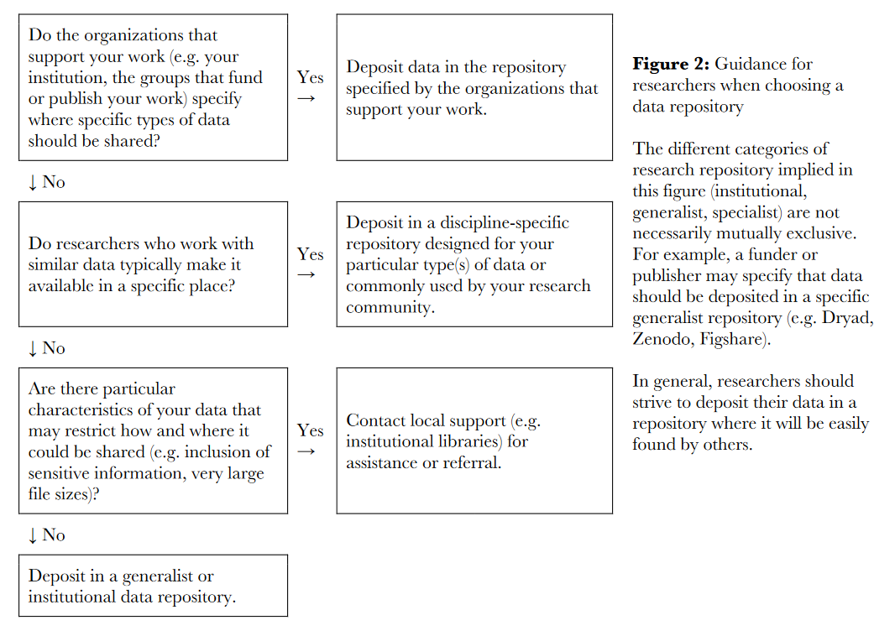
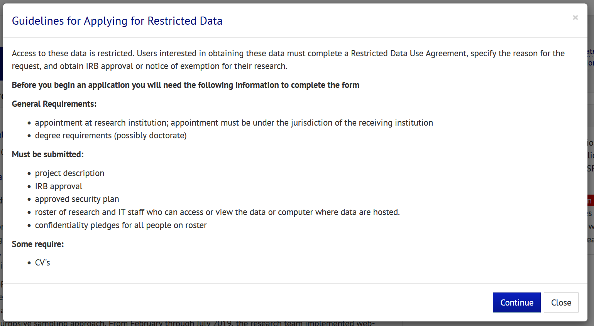

## Overview

---

Data sharing has become one of the most discussed areas around data management. With the growing number of funders requesting a data sharing plan (i.e. NIH), more people want to know how and why they should share their study data. In a 2019 [paper](https://journals.library.ualberta.ca/istl/index.php/istl/article/view/12), Pasek and Mayer found that data curation and re-use was cited as the area most needing improvement by graduate students across two universities. And in a way data sharing is a great jumping off point for many people to think about data management. With an end goal in mind, researchers can start to think about what structures they need to put in place to curate data that will be acceptable for data sharing.

---

## What is Data Sharing

---

While data sharing may sometimes encompass things such as sharing correlation matrices, summary tables, or study results, that is not what this section is about. This section is about sharing raw, item and case level, primary data collected as part of a research study. It can also include extant data collected and added to data that you collect. Beyond that overview, what types of data you share, how you share and where you share, may depend more on things like your funder, your budget, your project/participants, and your field. However, this section will provide many recommendations for what and how to share your data that will lead to the most benefits for you and your data.

---

## Why Share Data? {#share}

---

### Ten Reasons

1. Required by Funder

There are many reasons to share data and the number one reason may be that it is required by your funder. Almost all funders that education researchers work with now require data sharing in some form as part of their data management plan and the requirements are only getting more explicit and serious over time as agencies are better understanding the consequences of not sharing data and the benefits of sharing.

2. Engage in Open Science

While this term can be a catch all for many things, what I mean here is that sharing data allows researchers to review each others findings. This includes confirming and challenging the findings of others ([IES](https://ies.ed.gov/funding/pdf/EDPlanPolicyDevelopmentGuidanceforPublicAccess.pdf)). And through this process we enhance scientific rigor and reproducibility. "When a result can be reproduced by multiple scientists, it validates the original results and readiness to progress to the next phase of research" ([NIH](https://www.nih.gov/research-training/rigor-reproducibility)).

3. Accelerate Discovery

This is a reason mentioned in [NIH's documentation](https://grants.nih.gov/grants/guide/notice-files/NOT-OD-21-013.html). Sharing data promotes reuse for future studies by providing access to high-value datasets. This allows researchers to develop and answer questions to pressing education issues in less time than if they had to collect new original data.

4. Promote Collaboration

Sharing your data provides the opportunity for you to collaborate with new and existing collaborators to develop new research questions and studies with the data you have shared.

5. Combine datasets to gain new insights

This is an idea mentioned in ([IES materials](https://ies.ed.gov/funding/datasharing_policy.asp)) Similar to collaboration, sharing your data provides the opportunity to combine datasets across studies, allowing new discoveries. Combining datasets may also help those who have datasets with low-statistical power, and without combining datasets, are unable to answer questions of interest ([Logan, Hart & Schatschneider](https://edarxiv.org/2x3cu/)).

6. Save resources 

Similar to accelerate discovery, allowing other researchers to use your data, rather than collect new original data saves time, energy and money. Publicly archiving your data allows others to see what has already been collected, reducing duplicate data collection efforts. 

7. Increase citation rate

Sharing your dataset with an identifier such as persistent unique identifier (ex: DOI), allows you and others to cite your data in publications. You can track these citations to see the reach of your work.

8. Support equitable access to high-quality datasets

Similar to save resources, sharing data is a means to provide equitable access of high-quality datasets ([Logan, Hart & Schatschneider](https://edarxiv.org/2x3cu/)) for early career scholars, students, and underrepresented researchers.  Not all researchers have the budget, staff, or connections to collect high-quality datasets, but sharing your datasets freely and openly allows everyone the opportunity to work with these data. Sharing data also serves as an important resource for training future researchers.

9. Diversity of thought

Sharing data encourages diversity of analysis and opinions. Other researchers may have novel questions they can answer with your data that you have never considered. 

10. Transparency leads to better data management

One unintended consequence of data sharing may be that it promotes good data management practices. Knowing that you will eventually be sharing your data and documentation with others outside of your team may motivate researchers to think hard about how to organize their data management practices in a way that will produce data that they trust to share with the outside world.


Resources:

 📑 [Ashley Edwards 10 Benefits of Data Sharing](https://venngage.net/ps/Uz65vsS6hI/new-10-benefits-of-data-sharing)    
 📑 [Data Sharing in Education Science](https://edarxiv.org/2x3cu/)  
 📑 [Within and Between podcast: The what, why, how, and hesitations of data sharing](http://www.withinandbetweenpod.com/)

---

## Principles

---

### FAIR

As a reminder of what we covered in the [Data Management Module](https://cghlewis.github.io/mpsi-data-training/training_00.html), in 2016 the [FAIR Principles](https://www.go-fair.org/fair-principles/) were published in Scientific Data, outlining 4 guiding principles for scientific data management and stewardship. These principles should be referred to when choosing when, where and how to share your research data.

F: Findable

All data should be findable through a persistent identifier and have good data documentation, aka metadata. As we move towards automation in our work and life, the need for machine-readable metadata becomes more prevalent for automatic discovery of data.

A: Accessible

You data is accessible if humans can access your data. This can mean your data is available in a repository or through a request system. 

I: Interoperable

Use standardized vocabularies as well as formats. Both humans and machines should be able to read and interpret your data. Software licenses should not pose a barrier to usage. Data should be available in open formats that can be accessed by any software such as .csv, .txt, .dat, etc. Furthermore, thorough data documentation should accompany data.

R: Reusable

Your metadata should provide information on the broad context of your project as well as your data collection to allow for accurate use of your data. You should also have clear licensing for data use. 

Additional resources:

  📑 [Within & Between podcast](https://podcasts.apple.com/us/podcast/episode-4-the-what-why-how-and-hesitations-of-data-sharing/id1517310439?i=1000483521281)  
  📑 [Practical Solutions for Sharing Data and Materials from Psychological Research](https://journals.sagepub.com/doi/10.1177/2515245917746500)

---

## Planning for Data Sharing

---

While Data Sharing may often happen at the end of a project, planning for data sharing should happen at the beginning. For many funders, you'll be required to write a brief overview of your data sharing plan in your data management plan (DMP) as part of you grant proposal, and will also be allowed to submit DMP associated costs in your grant application budget requests. DMPs are often a supplement/appendix to your grant application and restricted to anywhere from 1-2 pages (NIH, NIJ and NSF) to a 5 page maximum (IES). For most funders these DMPs are not part of the scoring process, but they are reviewed by a panel or program officer. Some funders may provide feedback and/or ask for revisions if they believe your plan and/or your budget/associated costs are not adequate.

What to include in a DMP varies some across funding agencies. **While you should check each funding agency's site for their specific DMP requirements**, this comparison table provides an overview of 11 common categories covered in a data management plan and whether four large funding agencies ask applicants to address these categories in their data management plans, as well as any additional guidance they provide for each category.


**Categories to Include in a Data Management Plan and Guidance Provided by Funder**

```{r, echo = FALSE, message=FALSE, warning=FALSE}

library(tidyverse)
library(kableExtra)

data <- readxl::read_excel(here::here("data", "comparison.xlsx")) %>%
  mutate(across(everything(), ~replace_na(., "")))

data %>%
  kbl(align = c('l', 'c','c','c','c')) %>% 
  kable_styling(bootstrap_options = "bordered") %>%
  column_spec(1:5, width = "3in") %>%
  row_spec(c(1,3,5, 7, 9, 11, 13, 15, 17, 19, 21),background = "#b0d2da") %>%
  row_spec(c(2,4,6, 8, 10, 12, 14, 16, 18, 20, 22),background = "#7da1bf") %>%
  row_spec(0, background = "#2f4a60", color = "white") %>%
  scroll_box(height = "800px")

#data %>%
#  kbl(align = c('l', 'c','c','c','c')) %>% 
#  column_spec(1:5, width = "3in") %>%
#  kable_styling(bootstrap_options = c("striped")) %>%
#  row_spec(0, )
#  scroll_box(height = "800px")

```


<br>

However, even if your funder does not require a data sharing plan, there are still many reasons to consider sharing your data, as we covered [above](#share). Planning what, how, and when to share before your project even begins is the best way to ensure you have everything in order by the time you need to share your data. You can always update your plan during or after your project completion. If data sharing is required by your funder, it may be helpful to keep in contact with your program officer regarding any potential changes throughout your project.

Data Management Plan resources:

IES:

 📑 [IES Implementation Guide for Public Access to Research Data](https://ies.ed.gov/funding/datasharing_implementation.asp)        
 📑 [U.S. Department of Education Plan and Policy Development Guidance for Public Access](https://ies.ed.gov/funding/pdf/EDPlanPolicyDevelopmentGuidanceforPublicAccess.pdf)  
 📑 [IES Data Sharing FAQ](https://ies.ed.gov/funding/datasharing_faq.asp)   
 📑 [IES Policy Regarding Public Access to Research](https://ies.ed.gov/funding/researchaccess.asp)  
 📑 [DMP Tool Template IES](https://dmptool.org/template_export/1895.pdf)  
 
NIH:

 📑 [NIH Writing a Data Management and Sharing   Plan](https://sharing.nih.gov/data-management-and-sharing-policy/planning-and-budgeting-DMS/writing-a-data-management-and-sharing-plan)  
 📑 [Final NIH Policy for Data Management and Sharing](https://grants.nih.gov/grants/guide/notice-files/NOT-OD-21-013.html) 
 
NIJ:

 📑 [NIJ Data Archiving Plan](https://nij.ojp.gov/funding/data-archiving)  
 
NSF: 

 📑 [Data Management for NSF EHR Directorate Proposals and Awards](https://www.nsf.gov/bfa/dias/policy/dmpdocs/ehr.pdf)  
 📑 [NSF Dissemination and Sharing of Research Results](Dissemination and Sharing of Research Results - NSF Data Management Plan Requirements)  
 📑 [SPARC Data Sharing Requirement Comparison](http://datasharing.sparcopen.org/compare?ids=11&compare=data)


---

## Best Practices

---

While your funder may have guidance as well as requirements for your data sharing plan, there are also generally accepted best practices that you should consider when you construct your plan. Following required guidelines and best practices will help you provide data that is useful and accessible to researchers. 

However, the [Institute of Education Sciences](https://ies.ed.gov/ncee/pubs/2022004/pdf/2022004.pdf) put it best when they said, keep the big picture in mind. They listed out 4 big ideas to consider when planning for data sharing:  

1. Focus on sharing well-organized and well-documented data. Include all documentation necessary for someone with no familiarity with your project to pick up your data and make sense of it. Consider everything you can include so that future researchers aren't reaching back out to you with ongoing questions. Also, organize your data with a well designed structure. Don't share messy files that are inconsistent across the project. Share files that are standardized, uniform, and can be easily linked if necessary. 

2. Commit to sharing some data or code to facilitate analysis. If possible share more data beyond those used to produce a study's main findings. And if your data have restrictions and you are unable to share, is there anything you can share that is still in the vein of open science, such as code or aggregated data?

3. Don't get stuck on one single way to share data. Each project is unique and has it's own opportunities and constraints. Think outside the box about what means of data sharing works best for you, while also considering how to maximize impact.

4. Not most, but some projects will need to consider the possibility of tradeoffs. There may be times when sharing all of your data requires you to share with restricted access, while removing some variables and sharing only some of your data allows you to share the dataset openly. Researchers may need to consider what makes the most sense here, and in some circumstances you may be able to share data through of combination of methods.

### Where to Share Data

#### Repository

There are many reasons to choose a repository over alternatives such as sharing from your personal website or providing data upon request.

1. It's a good open science practice

Providing data in a repository allows your data to be publicly accessible. While saying you provide data upon request or providing access through a request system on your personal website is still data sharing, it misses the mark on the FAIR principles of Accessible. Repositories allow discoverability of your data through searchability. As opposed to sharing on a personal website or sharing data on request, sharing data in an open repository allows others to discover your data merely by searching for topics of interest. Authors can also link to their repository within publications.

2. Funders prefer it

As open data sharing has become a requirement for many federal funders, data management plans have started suggesting that PIs share data in a repository vs other options, if at all possible. IES, NIH and NIJ all recommend the use of openly accessible repositories over the alternative of having to contact PIs to request data.

3. Repositories provide persistent identifiers and licensing

Repositories offer unique persistent identifiers which allow datasets to be citable, meeting the FAIR principle of Findable. Researchers can track the contributions of their dataset through the citation of their dataset in published papers. Researchers can also add links to their repository data in papers.

Repositories also offer licensing which allow you to make clear how others can use your data. For example, LDbase, a Learning and Development Data Repository, suggests that depositors use the Open Data Commons Attribution License (ODC-by), which allows others to use, modify and share the deposited data but users must cite the dataset when doing so.

4. Using a repository provides a "hands-off" approach to data sharing

While preparing your materials for deposit in a repository may seem like a lot of upfront work, it is actually the least burdensome route for future you and your staff. Using a repository takes away the long-term commitment of your staff to respond to data requests and build datasets for requestors. In this respect, it also reduces cost. Costs associated with paying staff to respond to these data requests. Also costs for continuing to protect your data from "obsolescence, loss or irreversible damage" from humans or technology ([ICPSR](https://www.icpsr.umich.edu/files/deposit/dataprep.pdf)). Making sure your file types are becoming obsolete or protecting your data from corruption all take resources. [Roger Peng](https://simplystatistics.org/posts/2020-04-30-asymptotics-of-reproducibility/) likens this to "maintenance capital expenditure" in the business world. How much do I need to invest to keep up my promise of data sharing. Using a repository reduces this investment because, depending on the repository, they may take care of some or all of this for you.

5. Repositories provide viable options for restricted data

Some data may need to be for restricted use only, not available to the general public, either because of participant confidentiality issues, third-party licensing or due to consent language/use agreements that restrict data sharing.

For restricted use data, some repositories provide the option to have data housed in a secure data enclave which stores and protects data with the highest security. This data can be accessed through an application process where applicants agree to strict requirements to preserve confidentiality. "Some repositories assess applicants against a set of criteria, while others require the original researcher to grant permission for its use" ([IES](https://ies.ed.gov/ncee/pubs/2022004/pdf/2022004.pdf)). Some repositories may provide onsite data enclaves as well as remote secure access data enclaves. Remote enclaves do not allow users to download data to their computer but instead the user can analyze the data remotely.

6. Repositories may have resources to guide you through the data sharing process

While not all repositories have physical people available to help curate your data, repositories typically have detailed guidelines about what you **should** deposit and what formats those files should be in. This guidance can be very helpful for those who are new to data sharing and feeling overwhelmed by the process. It's a good practice, that if you plan to share your data in a specific repository, to reach out to that repository early. Work with them to develop your Data Management Plan (DMP), or review the requirements of the repository before completing your DMP so that you know what you will be expected to have together at the end of your study. This early investigation into a repository can help you organize your data management processes throughout the study. You can also start developing a schedule for ongoing deposits of data and documentation if that is something you want to consider doing throughout your study.

**Considerations for Choosing a Repository**

1. Domain specific vs General

One of the first choices you might consider is, do I want to use a domain-specific repository, relevant to my field, or a more general repository. Domain-specific repositories may be of more interest to researchers in your field and may be the best option to help facilitate discovery of your datasets. Using a domain specific repository can also help you ensure you are preserving data and providing documentation according to recognized standards in your field. However, there are many other considerations to take into account in addition to discoverability so weigh all options.

1. Cost

Consider the costs to both store your data and for users to access your data. There may also be costs associated with additional services such as data curation.

2.  Data Access

Consider how users access the data in the repository. Is access accessible to a wide audience? Are users required to have an account to access data or is that optional? 

Is it only data download or are there other ways to work with the data online as well? 

Does the repository have appropriate procedures to protect access to data? Does it offer options for restricted use files? Do researchers set the terms of use for restricted files or does the repository?

3. Data Security

For data security, consider how the data is stored and backed up. Also consider what standards the repository meets to ensure it is protecting participant confidentiality.

How is data stored? What storage is used and how often is data backed up? Is data encrypted during transfer and/or at rest?

Does the repository meet [GDPR (General Data Protection Regulation) standards](https://en.wikipedia.org/wiki/General_Data_Protection_Regulation#General_provisions) for data protection? 

Does the repository help you review your data for missed identifiers? 

4. Types and Formats of Data Accepted

Check for size limits of both the data files and the entire project. Also check which file types are allowed. Certain repositories may have preferences for file types for both data files and documentation files.

5. Assignment of DOI

Does the repository assign a direct object identifier which allows researchers to track the use and contributions of their dataset? This is an important deciding factor. A DOI allows your dataset to be findable, one of the FAIR principles. They can make your datasets easier to find and can be used to measure the citation impact of your dataset.

6. Viable Length of Deposit

Does the repository have the resources to stay afloat for the appropriate length of time to meet your funder's data sharing requirement? (i.e. 10 years for an IES grant)

7. Versioning and Removal

Do depositor's have permission to freely update and remove data from the repository? Does the repository version amended data? Do they notify users, who have already downloaded data, that there is a new version available?

8. Additional Services

Does the repository provide curation services to ensure high quality data is deposited? Ensuring data are in interoperable formats, with appropriate metadata, and identifiers removed? Or is that up to the depositor?

9. Linking Capabilities

Does the repository allow you to link to other projects, publications, code, or data? Does it allow you to link to your code on sites like GitHub? Does it allow you to link to other projects within the repository? Does it allow you to link to other projects or pre-registrations outside of the repository? Does it allow you to link to publications?

10. CoreTrustSeal

Is the repository certified by the [CoreTrustSeal](https://www.coretrustseal.org/)? This is not a must-have, but can be an additional assurance to both you and your funders that the repository you are choosing has been vetted by an independent authority to ensure your data will be managed and curated with high standards and that you will have continued access to your data.


**Repository Options**

Currently there are very few education specific repositories. Both LDbase and ICPSR are recommended by IES. LDbase being truly for education researchers, and ICPSR being a little more general, for social sciences. There are many general repository options though. A few well-known ones include Harvard DataVerse, Dryad, OSF, Zenodo, and FigShare.

[Institute of Education Sciences](https://ies.ed.gov/ncee/pubs/2022004/pdf/2022004.pdf) put together a table comparing 5 commonly used repositories.  

\*Note: There is an error for LDbase. They **do** allow you to update and remove data.

```{r, echo=FALSE, fig.align="center", out.width='70%'}

knitr::include_graphics("img/repo_table.PNG")

```

Resources:

 📑 [Registry of repositories](https://www.re3data.org/)  
 📑 [Great overview and comparison of 4 well-known repositories](https://evodify.com/free-research-repository/)    
 📑 [Additional Information on CoreTrustSeal](https://cdsweb.u-strasbg.fr/CTS-CDS)


#### Other means of data sharing

There may be reasons that you cannot share with a repository, maybe an agreement made with a study partner. Or you are just not ready to make the leap to depositing in a repository. Other options do exist. While these methods may technically meet the requirements of your funder, keep in mind that all of these options:

+ Reduce the visibility of your data. How will you notify researchers that your data is available?
+ Most likely increase the burden on you or your team to respond to requests and maintain data over time. 
+ Reduce accessibility of your data. These methods are likely to increase burden on your requestor who has to complete informal data requests, which are not always a streamlined process. This may reduce the number of people who use your data. 
+ Will be difficult to track the use of your datasets over time. Without assigning a DOI to your dataset, you will need to rely on requestors to notify you of future publications. Be sure to have a data request agreement in place that allows requestors to state the purpose of their request and their publication intentions.
+ Increase risks in data sharing. With no repository managing secure file transfers, your team will need to consider how to securely provide access to data for approved users.

Non-repository means of data sharing:

1. Deposit your data with an agency that you partnered with for the study (i.e. a School District). All data requests will go through that partner.

2. Share your data through a lab, personal, or project website. While this seems like an accessible option, you still need to remember the long term costs associated with maintaining this data and responding to data requests.

3. Informal peer-to-peer sharing. This may work well for peers but doesn't make a broader audience aware of the availability of your data and keeps the burden of data maintenance and responding to requests on you and your staff. Also, with no formal request system in place, this makes it difficult for the requestor to know who to contact to request the data or what information is needed to retrieve the data.

4. Supplemental materials attached to an article or stored on a publisher's website. 

5. The least recommended option here is to have a statement in your publication that says "data available upon request" and then provide an email for people to reach out to request data. There are countless horror stories where people have reached out to authors about getting data and they've either never heard back or were told that the data was not in fact, available. It is best to already have a system already in place and direct people to that system, either a repository, your personal website with a data request form, etc.

[Borghi and Gulick](https://arxiv.org/ftp/arxiv/papers/2110/2110.00888.pdf) put together a flow chart for choosing where to deposit your data that can be helpful to navigate your options. Although, to the point about restricted data, while the authors refer you to institutional libraries, we've seen that some repositories do allow you to submit restricted data to be accessed in enclaves.

```{r, echo=FALSE, fig.align="center", out.width='80%'}



```


### What data to share

#### Considering what to share

**Consent**

+ The first thing to review before sharing any data is, what did you say you were going to do in your approved IRB consent form, or more importantly, what language you did NOT use. 
    - Make sure you didn't use any language that suggested you are "not going to share data" or that you "plan to destroy data" at a certain point. You want your consent language to be broad and not restrict your data sharing to aggregate tables. 

+ You want your consent language to discuss confidentiality but also mention that there are still risks.
    - Make sure your consent form explains that your team will make all reasonable efforts to de-identify data and keep it secure, but it is impossible to guarantee that your data may never be linked back to you. However, due to the extensive de-identification process, the harm or risk to the participant would be minimal. 
    - If your consent form does not warn about the possibility of re-identification, in addition to removing direct identifiers from your data, you need to really consider small sample sizes and combinations of variables that might allow some to re-identify a participant.
    
+ It's a bonus if you used language that explicitly states that you plan to publicly share data in a trusted repository and participant's data may be used for future research.

+ When putting your data together for sharing, review permission to share and remove any consented participant who did not give permission for you to share their data. This information *should* have been tracked in your participant tracking database at the time of consent collection.

+ Refer back to [Module 2](file:///C:/Users/Crystal/Desktop/desktop/R/Book/mpsi-data-training/training_2.html) for Meyer's dos and don'ts of consent form language.

Resources for additional information on consent language:

 📑 [Data Sharing in Education Science](https://edarxiv.org/2x3cu/)  
 📑 [ICPSR](https://www.icpsr.umich.edu/web/pages/datamanagement/confientiality/conf-language.html)   
 📑 [Shero and Hart: Working with your IRB](https://figshare.com/articles/preprint/Working_with_your_IRB_Obtaining_consent_for_open_data_sharing_through_consent_forms_and_data_use_agreements/13215305/1)  


**Funder requirements**

You'll also want to review what you laid out in your data management plan in your project proposal. What did you say you would share (although this can be adjusted) and what did your funder suggest you do share? Most funders will state that at *minimum*, the data underlying your peer-reviewed, published study findings should be shared. However, most funders will also note that you should consider sharing more than that. 


#### Data

Researchers should consider sharing all primary data collected through the project, including both raw (item-level) and derived variables and can also consider sharing any existing data linked to original data. If extant data is included, make sure to review any existing data licenses associated with that data that may impact data sharing. There may also be some item-level data that cannot be shared. Review copyright for published scales to see what is allowed. Some paid assessments may only allow you to share derived scores or un-labelled item-level information (ex: "item 1 of assessment" vs "the actual question wording") ([Jessica Logan](https://figshare.com/articles/presentation/Data_Sharing_and_Data_Shared/15040740)).

**Format**

You'll need to consider what format to share your data in. This encompasses many decisions.

1. Raw vs Clean vs Analytic files

+ The **true raw data** is the data that comes directly from the source with no manipulations. The problem with this raw data is, it's not usually in a user-friendly format. Metadata is not usually applied, variable names aren't decipherable, and values may be confusing. The other thing about the true raw data is, you may have not yet removed participants who are not in the study, removed duplicate instances, or removed identifying variables. This data should never leave your secure data storage area, approved by IRB, in your lab. 

+ The next level is **de-identified raw data**. This is your raw data as mentioned above, but with identifiers removed, duplicates removed, and checked to ensure that only consented participants are included. While this file *can* be shared, I still don't find this file very useful for those wanting to use your data. 

+ The third level is a **cleaned data file**. This is your raw data file, checked to ensure that only consented participants are included, de-identified, and cleaned to a usable standard. If you refer back to our discussion on [data cleaning steps](https://cghlewis.github.io/mpsi-data-training/training_4.html#Data_cleaning_steps), it would include the transformations mentioned there. Think of a dataset with interpretable and consistent variable names, with metadata added (such a variable and value labels), and coded consistently. This is a data file that is “ready for analysis”. This means the dataset should be in the minimally accepted format for a future researcher to be able to pick up the dataset and do some basic exploratory analysis with the dataset without having to dig deep into the documentation. This is a broad, clean, general dataset that ANYONE can use. It will include all item-level data as well as any derived scores (sum scores, means) or created variables (ex: cohort, time) necessary to complete the file. My recommendation is that **this** is the file you share.

+ The fourth level is an **analytic file**. While people use this term in different ways, what I am referring to here is a file prepared, based on the aforementioned cleaned data file, that has additional transformations that are *created solely for the purpose of that specific analysis*. You can think of this as a file used as the basis of a specific publication. While I do recommended this file to be shared as well, I view this as a secondary source, shared for the purposes of allowing replication of your study, rather than for the purposes of people using your data for their own future analyses.

2. Merged vs Unlinked

If you are collecting data across time or collecting different forms within time but across participants, you will need to consider whether or not you want to merge files before sharing or provide distinct files that users can merge on their own.

+ **Merging datasets** may be a great options for longitudinal studies with many waves of data collection. Merging files across time can reduce the burden for researchers who want to view all data across time for each unit of analysis. You may consider making a merged file for each participant level (student level dataset, teacher level dataset, school level dataset). While education researchers typically merge their datasets in wide format, where each case is one row, there may be reasons to merge your data in long format. Merging in long format is more efficient for data storage and may make data contents more clear. Variable names stay the same across time (rather than have time appended to them), and each case has a row of data for each time point they were in the study.

+ **Uploading datasets separately** is another option though. Keeping data in separate files reduces file size and may make it easier to upload and access data. It may also make it easier for researchers to narrow down files to their variables of interest. If they are only interested in one form from the student dataset, having the forms separated allows researchers to download just the file for that one form, rather than downloading the larger dataset and dropping variables not relevant to their research. If you decide to share datasets separately in repository, consider developing a folder and file naming structure that allows researchers to know what they are working with. You will also need to ensure that your files have identifiers to link datasets. Consider adding a README to your documentation that lays out how files can be linked through identifiers.

```{r echo=FALSE, comment=NA}
library(data.tree)

project <- Node$new("project-name")
  files_1920 <- project$AddChild("files_1920")
    student <- files_1920$AddChild("student")
    teacher <- files_1920$AddChild("teacher")
  files_2021 <- project$AddChild("files_2021")
    student2 <- files_2021$AddChild("student")
    teacher2 <- files_2021$AddChild("teacher")
          
print(project)

```


3. File format

+ Most funders, including IES, prefer data to be deposited in an electronic, rectangular format. It is also recommended to provide data in at least one non-proprietary format that is not restricted to a specific software. This not only provides access to a broader audience, those without specific software licenses, but also protects against technological obsolescence. Open formats include text files like .csv, tab-delimited, or ASCII. This recommendation meets the FAIR principle of interoperable.

+ It is nice, however, to **also** share data in formats that have embedded metadata, created using programs such as SAS, Stata, or SPSS. You can either export a file that allows embedded metadata (.sas7bdat, .dta, .sav), or you can create raw ASCII files along with setup files for people to run in specified statistical programs. Providing your data in more than one format (non-proprietary and proprietary), can give your user options and also protect your data from obsolescence.

+ It is important to review your repository requirements. ICPSR for example, prefers submissions of files with embedded metadata, such as SPSS, Stata or SAS files. They then use these files and curate them into ASCII data with setup files to accompany statistical programs. The National Archive of Criminal Justice Data used by NIJ prefers SPSS formats for quantitative data, but will also accept Stata or SAS files.

**Confidentiality**

No matter what data you share or what format you share it in, you need to consider confidentiality. All data you share should be de-identified. This includes removing direct identifiers as well as reducing the risk of confidentiality breaches through indirect identifiers or deduction.

1. De-Identified Data

+ Direct Identifiers

  + These are personally identifiable information (PII) like we discussed in [Module 2](file:///C:/Users/Crystal/Desktop/desktop/R/Book/mpsi-data-training/training_2.html#Data_Storage). These are typically identifiers collected for data collection and project implementation purposes but not necessary for secondary analyses and should be removed before sharing data. These include the [18 HIPAA identifiers](https://www.luc.edu/its/aboutits/itspoliciesguidelines/hipaainformation/18hipaaidentifiers/) as well as [FERPA Identifiers](https://studentprivacy.ed.gov/content/personally-identifiable-information-education-records#glossary-node-210), such as:

    * Name
    * Email
    * Phone Number
    * Social Security Numbers
    * State, District, or School level assigned Student IDs
    * IP Address

  + If schools and districts were promised confidentiality, names of schools and districts will need to be removed as well.

  + In replacement of names, random study IDs (either numeric or alphanumeric) should be used to allow linking across forms and time, as well as clustering of observations as needed. IDs should not be assigned in a logical order, such as alphabetical. They should also be completely distinct from identifying information such as name and birth date. If IDs were assigned this way during the study, or IDs were shared throughout the study with participants, consider assigning yet another set of study IDs for the purposes of publicly sharing data. You will want to track both sets of these IDs in your participant tracking database.

+ Indirect Identifiers

  + These are identifiers that may not independently link to an individual in your study but through combinations of these variables, or small group sizes, individuals may be identified. 

    * Birth date
    * Small counts of gender, race, special education, or other demographics (Review categorical variables with categories of 5 or less, some people may see 3 or less)
    * Crosstabs of variables (ex: grade level and special education status)
    * Geography (ex: zipcode)
    * Exact dates of events

  + A few methods, **there are many more**, to account for these variables are:

    + Top or Bottom Coding: This is a method of restricting the upper and lower range to mask outliers. For something like income you may top code to "$150k or higher".

+ Combine/Collapse categories: For categorical variables with categories containing Ns of 5 or less, consider combining categories into an "other" category. If issues of small sample size occur with crosstabs, you can also consider merging two or more variables into a new summary variable.
    
    + Aggregation: Identifier variables here are replaced with higher level aggregations of information. For example you may aggregate zip code to county or state level geography or aggregate birth date to year of birth.
    
    + Recode continuous variables: Continuous variables with outliers can be collapsed into categories to reduce the chances of participant deduction.

    + Remove/redact variables: This often happens with variables such as birth date. Most researchers want birth date for an age calculation so it is feasible to calculate age variables using your dates of interest (ex: assessment date) and then remove both birth dates and assessment dates before sharing data.


+ Open-ended comments/questions

  + These types of open-ended text boxes need to be considered for any identifying information. You can either choose to remove all open text variables before sharing data or code all responses into a categorical variable.

+ Once your data has been de-identified, this data is ready to ready to be released on the internet. If no other restrictions exist for this data (i.e. a data use or sharing agreement) the data follows the Release and Forget model. There is little control a data owner has once the data is released into the world outside of any licenses that have been assigned, and any terms of use requestors agree to when accessing the data.


Resources on de-identification:

 📑 [Schatsneider, Edwards, and Shero have a great paper on data de-identification](https://figshare.com/articles/preprint/De-Identification_Guide/13228664)   
 📑 [J-PAL has an excellent table of direct and indirect identifiers, as well as recommended de-identification methods on page 10](https://www.povertyactionlab.org/sites/default/files/research-resources/J-PAL-guide-to-deidentifying-data.pdf)   
 📑 [Great recommendations on de-identification of data from LDbase](https://infograph.venngage.com/ps/5p6yjaAGTSs/new-5-things-to-check-for-data-deidentification)   
 📑 [ICPSR has a discussion on treating indirect identifiers](https://www.icpsr.umich.edu/files/deposit/dataprep.pdf)   
 📑 [IES has a section on Disclosure Risk Management in their Sharing Study Data Guide](https://ies.ed.gov/ncee/pubs/2022004/pdf/2022004.pdf)   
 📑 [The Turing Way provides examples of anonymizing data](https://the-turing-way.netlify.app/reproducible-research/rdm/rdm-personal.html)    
 📑 [National Institute of Standards and Technology De-Identification Guide](https://nvlpubs.nist.gov/nistpubs/ir/2015/NIST.IR.8053.pdf)


2. Identifiable Data

  + If you are unable to remove all identifiers, if your consent agreements do not allow you to share data, or if identifiers are integral for linking datasets, then you have the option of creating a restricted use file. These files can be shared through a data enclave. Some repositories may provide both the option of onsite data enclaves as well as virtual secure access enclaves. Using remote access enclaves, users are not allowed to download data but are able to analyze data remotely. Onsite data enclaves typically have security measures in place such as no windows, key card entry, and a computer with no internet access. These enclaves are also typically monitored by archive staff. Access to these restricted data are permitted only through an application process where requestors complete a detailed data use agreement.
  
  + Even if you need to create a restricted access file, it is important to consider creating a second, de-identified file as well to maximize public benefit. The public access version may have more variables removed for categories collapsed to create anonymity while the restricted file will leave limited identifying information in the data. However, be sure to consider all possible disclosure risks before sharing to ensure that someone with access to both the restricted and public files are not able to identify individuals. Also make sure that no inconsistencies between files are created during the de-identification process.

[The United States Department of Health and Human Services](https://www.childandfamilydataarchive.org/cfda/archives/CFDA/studies/38290/summary) has a great example of depositing restricted access research study data in a repository (Child and Family Data Archive). You can see here that various metadata are available for the study but restricted data are not available for direct download.

```{r, echo=FALSE, fig.align="center", out.width='100%'}

knitr::include_graphics("img/restricted_use.PNG")

```

```{r, echo=FALSE, fig.align="center", out.width='95%'}



```


3. Data Use vs Data Sharing Agreements

* Data Use Agreements are legally binding formal agreements (contract) used when sharing data with restricted access. [Florida State University](https://www.ldbase.org/resources/best-practices/data-use-vs-data-sharing) has an example of a DUA here. 

  * The topics typically outlined in a DUA include:

    * Terms and conditions of the use of the data, including prohibiting any attempt to re-identify the data, linking to
  other data or redistribution
    * Review access controls
    * Obligations for keeping the data secure during time of access
    * Liability of harm from using the data
    * Publication rules
    * Privacy rights

  * While the user is typically also required to provide the following information:

    * What is their research plan and reasons for needing access to confidential information
    * A data protection plan for keeping data secure
    * IRB approval

* Data Sharing Agreement are documents that researchers may wish to have users complete when they want to list the terms of use of their data. This is a less formal agreement and can be used when you are sharing de-identified data. LDbase has a great [sample Data Use Agreement](https://www.ldbase.org/resources/templates/example-data-sharing-agreement). Reasons for using a data sharing agreement might include:

  * You are still actively analyzing your data and want to limit access
  * You want users to agree to specific terms of use, such as adding you as a co-author on papers using your data or ensure users cite your data in publications
  * While your data may be de-identified there may still be qualitative data or small sample sizes that could potentially make participants identifiable so you want to restrict who uses the data and ensure users have a plan to maintain confidentiality
  * You want to limit the types of research projects that use your data

Resources:

 📑 [ICPSR provides more detail on Data Use Agreements](https://www.icpsr.umich.edu/files/deposit/dataprep.pdf)     
 📑 [LDbase explains data use vs data sharing agreements](https://www.ldbase.org/resources/best-practices/data-use-vs-data-sharing)  
 📑 [UNC Data Use Agreement Flow Chart](https://research.unc.edu/wp-content/uploads/sites/61/2013/04/CCM3_039360.pdf)

<br>

### What documentation to share

I think the general rule is, share as much documentation as you possibly can! But to narrow that down, I've provided some general guidance below.

#### Considering what to share

**What is suggested from your funder?**

If you completed a data management plan as part of your grant proposal, it's likely that your funder asked you to  very likely that your funder provided some general guidance on what type of documentation they expect you to share. Depending on the document you read, IES generally suggests you share things such as codebooks that describe each measure, syntax files used to convert raw data to analytic data, and general project level data that allows users to know to better understand the purpose of the project and what activities happened during the grant. See [DMP table](xxx) above to read more about what funders suggest.

**What is required from your repository?**

Each repository may also mandate specific documentation or may suggest types of documentation to provide. Review the requirements of your repository early on in your project so you can plan for appropriate documentation. [ICPSR](https://www.icpsr.umich.edu/web/pages/deposit/index.html
) for example provides suggested documentation to include, such as codebooks, instruments, README files, project summary documents and publications. And they also have an intake form that allows you to enter project level metadata when you submit your data to their system.

#### Types of documentation to share

Similar to what we discussed in Module 1, documentation can be categorized into 3 different types of metadata. Consider sharing something from each of these categories to give users the best overview of your project and how to use your data.

1. Project level documentation

This documentation should give a user a holistic picture of the project: What was the purpose, who participated, and what activities happened during the study. Some of this documentation may be directly entered into your repository (check before developing this as a standalone document), or it may also be provided as a standalone document. For example, both [ICPSR](https://www.icpsr.umich.edu/web/pages/deposit/deposit-fields.html) and [LDbase](https://www.ldbase.org/resources/user-guide/information-to-gather/project-metadata) have an intake form that allows you to enter this information directly into the system upon submission.

Sections to consider including in this document:
  + Funding Source
  + Overview of study
  + Intervention and Research Design
  + Setting and Sample
  + Project Timeline (what data was collected, on whom, and when)
  + Measures Used in Study (including citations)
  + Overview of Procedures (Recruitment, Consent, Inclusion/Exclusion Criteria, Randomization, Data Collection, Data Preparation and Processing)
  
Supplemental project level documents that can also be included are:
  + Consort Diagrams
  + Data Collection Instruments
  + A Table of Response Rates for Instruments
  
2. Dataset level documentation

This documentation provides a big picture sense of what datasets are included in the project and how they are connected. The type of dataset level documentation to consider including when data sharing is a README. As discussed in Module 1, a README is a plain text document that can serve many purposes. It literally is an indicator to users to "Read Me" before moving forward with this data. In the context of data sharing, your README should include things such as
  + The file name of each included dataset
  + How datasets can be linked together (linking variable)
  + Ns of each dataset
  + Any acronyms used in each dataset worth knowing (ex: st_ = student measures, tch_ = teacher measures)

See p.58 of the [IES Sharing Study Data Guide](https://ies.ed.gov/ncee/pubs/2022004/pdf/2022004.pdf) for an example of a README.
  
3. Variable level documentation

This is documentation that allows users to know exactly what is included in your data files and how to interpret each column. There are two types of variable level documentation to consider including.

+ Data dictionary: This rectangular document describes every variable in each dataset, how the variables are coded, and any transformations made to any variables. This can also include information such as scales associated with each variable, survey skip patterns, variable universe, and missing values assigned. See p.46 of the [IES Sharing Study Data Guide](https://ies.ed.gov/ncee/pubs/2022004/pdf/2022004.pdf) for an example of a simple data dictionary.

+ Codebook: This is a text file or pdf that provides summary level information about the associated dataset and variables. Without ever having to open the data file, a user can see summary statistics about the data and make decisions based on that information. This file should include every variable in the data and provide information such as the name, label and type, as well as summary statistics for each variables (Ns, percents, means, ranges, and percent missing). See p.48 of the [IES Sharing Study Data Guide](https://ies.ed.gov/ncee/pubs/2022004/pdf/2022004.pdf) for an example of a codebook.

**Note:** These terms are often interchangeable. You will notice that in the IES Data Sharing Study Data Guide, they refer to a Codebook as as Summary Statistics Document and they refer to a Data Dictionary as a Codebook. Depending on what organization you work with, different terms may be used, but the ideas are all still the same. 

4. Other documentation to include:
  + Publications: These can be either shared in the project or linked within the project to another site where the publication lives.
  + Code: In terms of code, I believe there are two types of code that can be shared:
    1. **Raw data cleaning code**: This is the code used to transform your true raw data to your cleaned data file. I am a believer that you do not need to share this code. It is often not something anyone would be interested in and there could potentially be 40 or more syntax files to clean each form of data for each wave of data collection. If you want to share the transformations you performed on the raw data to get to your clean file, I would suggest adding these transformations to your data dictionary. It will be easier to read (not in code) and less overwhelming for the user. You simply add a column to your data dictionary that is called something along the lines of "recodes" or "transformations". See example below. You can also consider including a data cleaning plan, discussed in [Module 4](xx), either in replacement of adding your transformations to your data dictionary, or in addition to. Providing a data cleaning plan gives a linear look at the order of transformations that you performed.
    2. **Analysis code**: This is the code used to transform your cleaned data file into your analytic file, created solely for the purpose of some analysis. This is usually code you use to narrow the sample, narrow the variables you use, and do additional transformations specifically for your analysis. If you plan to share any analysis level files, I do recommend sharing this code. However, before sharing this code, you need to review this code for identifiers. Are there any names or other direct identifiers (either in the code or the comments) included in the code that need to be removed before sharing? Also plan to remove any absolute paths to your personal working directories and replace with relative paths. 

Ex: Data Dictionary with Transformations    
```{r echo=FALSE, message=FALSE, warning=FALSE, out.width='10%', out.height= '50%'}

library(tidyverse)

tibble::tribble (~ var_name, ~ label, ~type, ~original_value, ~transformation, ~final_value,
                 "item1", "I like pizza", "numeric", "1 = agree, 2 = neutral, 3 = disagree", 
                 "1 -> 3, 2 -> 2, 3 -> 1", "1 = disagree, 2 = neutral, 3 = agree",
                 "item2" , "I don't like school", "numeric", "1 = disagree, 2 = neutral, 3 = agree", "NA", "NA") %>%
gt::gt()
  
```

<br>

#### Format of Documentation

**Repository Requirements**

If you are sharing data with a repository, check their requirements before creating documentation. Each repository may have required or suggested documentation formats. For example, [ICPSR](https://www.icpsr.umich.edu/web/pages/deposit/index.html) requires documentation to be submitted in Word, ASCII or DDI XML format and they in turn convert your documentation to XML or PDF format. [NIJ](https://nij.ojp.gov/funding/data-archiving) which has it's own suggested repository, National Archive of Criminal Justice Data (and ICPSR sponsored archive), requests documentation to be in PDF, Word, or ASCII format. You'll also want to check if there are any metadata standards your repository complies with, such as [DDI standards](https://www.icpsr.umich.edu/web/pages/datamanagement/lifecycle/metadata.html), and if that requires any additional considerations on your part or if the archive does the work to make sure standards are met.

**General Suggestions**

In general, sharing documentation in non-proprietary formats is recommended. These are files anyone can open no matter what software they own. PDFs and text files are generally good formats. If a rectangular format is required, for documents such as metadata, csv files can be created and still opened in any spreadsheet program.

<br>


### When to Share Data

Similar to what data and documentation to share, in terms of when to share data, you want to consider both your funder's requirements, your repository's suggestions, as well as your own personal preferences.

**Funder Requirements**

Your funder will most certainly have a suggested time frame for when they expect your data to be shared. [IES](https://ies.ed.gov/funding/datasharing_implementation.asp) for example states that study data must be shared no later than when you publish the main findings of your study. This is a typical recommendation from funders.

**Repository Suggestions**

If you are depositing your data in a repository, you may also find they provide guidance on when to share your data. [ICPSR](https://www.icpsr.umich.edu/files/deposit/dataprep.pdf), at minimum, requires that users deposit data before the end of a project so that any issues with the data can easily be resolved. However, they also recommend to begin uploading data as soon as possible after each wave of data collection. If you choose this method, ongoing data deposit, you will want to consider if you would like to embargo your data. Embargo means you deposit your data with delayed dissemination, delaying the public release of your data until a later time point (for example, after your study is complete). This allows you to continually deposit your data (to reduce workload at the end of your study), while also allowing you sole access to your data while your project is active. If you choose to deposit data on an ongoing basis, make sure that your repository allows you to edit, update and version your data if errors are found or changes are needed at any point during the project.

<br>

Overall Helpful Data Sharing Resources:

 📑 [Sara Hart gave a talk at the 2022 COS Unconference on Data Sharing that is very insightful](https://www.youtube.com/watch?v=24LTVqHi7hw)
 📑 [ICPSR's Data Preparation and Archiving Guide](https://www.icpsr.umich.edu/files/deposit/dataprep.pdf)
 📑 [LDbase has tons of helpful guides](https://www.ldbase.org/resources)


---

## Retraction and Revisions

---

Data Sharing is a great service to the larger community and that service it is built upon trust. It's built upon you trusting that your data is accurate and represents the true information that you collected. It is also built upon users putting their trust in you and your data, that the data you provide are accurate and free from errors, and that the findings you publish are based off of data that are free from errors and manipulation.

This means, when you find errors in the data that you have publicly shared, you have an obligation to do something about it.

**If your data is deposited in a repository:**

1. Consider making a comment in your project, notifying users of errors in the data. If the repository requires/allows users to make an account before accessing the data, they may have a system to email current users to let them know a new comment was added to a project they have downloaded.

2. If the errors in your data is fixable, take time to go back to the raw data and re-clean, making the appropriate edits.

3. Upload a new version of your data to the repository. Make comments about the revisions so that users know what changes have been made between the previous and new version of your data.

If your data is not in a repository:

1. Do the same as above but instead, consider personally reaching out to anyone that has submitted a data request to you, to make them aware of errors and changes in the data.


If you have used your data in a publication, you will need to consider retracting the paper from the journal. Contact your journal to make them aware of the errors you found. Consider the story of [Dr. Kate Laskowski](https://laskowskilab.faculty.ucdavis.edu/2020/01/29/retractions/), who began finding errors in her data, after publishing with it, and decided she had no other choice but to retract her publication. You can find the retracted article [here](https://www.journals.uchicago.edu/doi/full/10.1086/708066?mobileUi=0).

An [article](https://www.sciencedirect.com/science/article/pii/S0213911118300724) in Science Direct found that across a three year span, of all the articles retracted in the journal PubMed, data processing errors were the number two reason for journal retractions. Errors happen, we are all human, but it is best to take the time and care to manage your data during your project so that retractions are not necessary later on.

 
 To learn more about reasons for retractions, you can read the blog [Retraction Watch](https://retractionwatch.com/) or search their [database](https://retractionwatch.com/retraction-watch-database-user-guide/).
