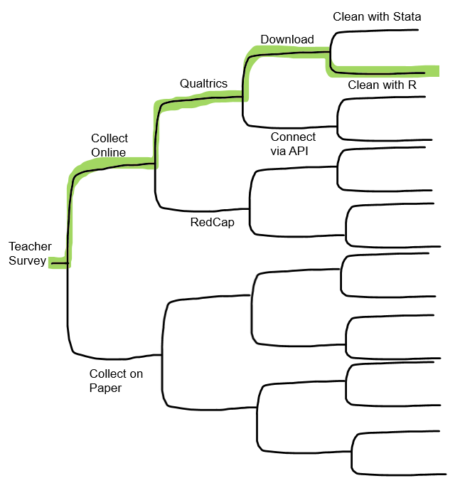
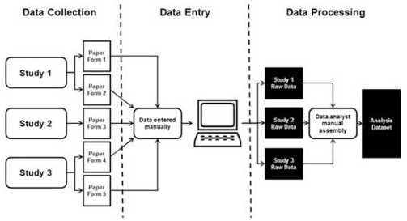

---

## Overview

---

This module is about connecting all of the pieces of the puzzle and thinking about how we can move from simply knowing what good data management *should* look like, to planning how you will actually manage data in your lab, for your projects, and with your team.

For the most part, the modules in this website have discussed phases of data management and best practices as independent steps in the data management life cycle. Yet we know very well, that all of these phases are dependent and connected. Before we begin to choose which practices to implement, we need to be able to put practices in context of outcomes (what are the benefits of implementing different practices). We then move on to review the data management and research life cycle to better understand how each module fits into the larger process. Then, we talk about *when* to start choosing the practices you want to implement, and provide checklists as tools to use in the planning process. And last, we talk about putting it all together by creating a data management workflow that works for you.

---

## Importance of best practices

---

While there are MANY reasons to implement good data management practices (ex: funder requirements, legal and ethical mandates, contributing to open science, etc.), I think we can boil the benefits of data management down to 3 basic outcomes. Good data management produces **reproducible**, **reliable**, and **secure** data for you and future users.

Let's connect these outcomes to actions that we have covered in previous modules:

**Reproducible**

Reproducible is defined as being able to produce the same results using the same materials and procedure. This could be anything from reproducing a data collection effort to reproducing a clean data file.

Data Management practices that contribute to reproducibility include:

- [Documentation](https://cghlewis.github.io/mpsi-data-training/training_1.html)
- [Style Guide](https://cghlewis.github.io/mpsi-data-training/training_3.html)
- [Data Cleaning Plan](https://cghlewis.github.io/mpsi-data-training/training_4.html)
- [Syntax Writing](https://cghlewis.github.io/mpsi-data-training/training_4.html#Reproducible_syntax)

**Reliable**

Reliable data is accurate/true and complete data that you can trust. Unreliable data might include problems such as inaccurately entered data, incorrectly coded variables, or missing values, and can lead to inaccurate decision making.

Practices that contribute to reliable data include:

- [Creation of data collection tools using data dictionaries](https://cghlewis.github.io/mpsi-data-training/training_2.html#Data_Collection_Instruments)
- [Participant tracking](https://cghlewis.github.io/mpsi-data-training/training_2.html#Participant_Database)
- [Double entry of physical data](https://cghlewis.github.io/mpsi-data-training/training_2.html#Data_Entry)
- [Versioning of data and code](https://cghlewis.github.io/mpsi-data-training/training_1.html#Miscellaneous)
- [Validity checks](https://cghlewis.github.io/mpsi-data-training/training_4.html#Data_cleaning_steps)


**Secure**

Data security involves storing and sharing data in a way that protects participant confidentiality as well as prevents loss of information.

Practices that contribute to data security include:

- [Storing paper and electronic data according to your IRB and DCL Rules](https://cghlewis.github.io/mpsi-data-training/training_2.html#Data_Storage)
- [De-identifying data](https://cghlewis.github.io/mpsi-data-training/training_2.html#Data_Storage)
- [Training staff on data security](https://cghlewis.github.io/mpsi-data-training/training_2.html#Data_Storage)
- [Requiring data access and use agreements](https://cghlewis.github.io/mpsi-data-training/training_2.html#Data_Storage)
- [Assigning roles and responsibilities](https://cghlewis.github.io/mpsi-data-training/training_0.html)


---

## Research Life Cycle

---

We touched on the research life cycle in the [Project Management module](https://cghlewis.github.io/mpsi-data-training/training_0.html#Project_Life_Cycle). However, I think it's important now that we have gone through best practices, to put them all into context of where they fit in the data management life cycle.

Below we have a research life cycle image that shows how data management and project coordination work in parallel and collaboratively throughout a study. I typically think of the project management/coordination path as consisting of the PI/Co-PI as well as the project coordinator, and any other staff in charge of implementing the project as well as any intervention. The data management path consists of anyone in charge of working with data or data products (such as documentation or data collection tools), and again could still include PIs/Co-PIs, project coordinators, data managers and any other staff working with data. Sometimes the project team and the data team are the same people (especially if the team is small). Either way, it is still helpful to see how these paths work simultaneously and collaboratively.


Moving from left to right:

1. In a typical study we first begin by generating ideas, deciding what we want to study. 
2. Then, most likely, we will look for funding to implement that study. This is where the two paths begin to diverge. If the team is applying for federal funding, the proposal and budget are created in the project management track, while the 2-5 page required data management plan (DMP) is created in the data track. Again, it may be the same people working on both of these pieces.
3. Next, if the project is funded, the project team will begin planning things such as hiring, recruitment, data collection, and how to implement the intervention. At the same time, those working on the data team will begin to plan out how to specifically implement the 2-5 page DMP submitted to their funder and start putting any necessary structures into place.
4. Once planning is complete, the team moves into the cycle of data collection. It is called a cycle because if your study is longitudinal, every step here will occur cyclically. Once one phase of data collection wraps up, the team re-enters the cycle again for the next phase of data collection, until all data collection is complete for the entire project.
   - The data management and project management team begin the cycle by starting documentation. You can see that this phase occurs collaboratively because it is denoted with a double outline. Both teams begin developing documentation like data dictionaries, style guides, and protocols. 
   - Once documentation is started, both teams begin to create any necessary data collection instruments. These instruments will be created with input from the documentation. During this phase the team may also develop their participant tracking database.
   - Next, the project management team moves into the data collection phase. This may involve recruitment and consenting, as well as data collection. At this point, the data management team just provides support as needed.
   - As data is collected, the project team will track data as it is collected in the participant tracking database. The data management team will collaborate with the project management team to help troubleshoot anything related to the actual tracking database.
   - Next, once data is collected, the teams move into the data capture phase. This is where teams are actively retrieving or converting data. For electronic data this may look like downloading data from a platform or having data sent to the team via a secure transfer. For physical data, this may look like teams entering paper data into a database. Oftentimes, this again is a collaborative effort between the project management team and the data team.
   - Once the data is captured, it needs to be stored. While the data team may be in charge of setting up and monitoring the storage efforts, the project team may be the ones actively retrieving and storing the data.
   - Next the teams move into the cleaning and validation phase. At this time the data team is reviewing data cleaning plans, writing data cleaning scripts and actively cleaning data from the most recent data collection round.
   - And last, the data team will version data as it is updated or errors are found.
5. The teams then only move out of the active data collection phase when all data collection for the project is complete. At this time the project team begins analyzing study data and working on publications. They are able to do this because of the organized processes implemented during the data collection cycle. Since data was managed and cleaned throughout, data is ready for analysis as soon as data collection is complete. Then, while the project team is analyzing data, the data team is doing any additional preparation to archive data for public sharing.
6. Last, the team submits data for public sharing.


---

## Planning Data Management

---

Data management planning is **the most** important step you can implement in the data management life cycle. Data management planning is the catalyst for reaping all of the benefits mentioned above. Without planning, the chances of inconsistencies, lost data, and human errors increase greatly. Think about a project where data is collected inconsistently, files are saved haphazardly, data cleaning is not well documented, and data is stored and shared without rules for security. It sounds like the story line of a data management horror narrative.

We saw in our data management flow chart above, that data management planning is mentioned twice. First it is mentioned in the context of a data management plan (DMP), the 2-5 page document required by federal funders that we reviewed in [Module 5](https://cghlewis.github.io/mpsi-data-training/training_5.html#Why_Share_Data). And while DMPs provide a hopeful guide for future practices, there is often a disconnect between the broad theory behind those plans and the actual complex implementation of those plans in practice ([Borycz, 2021](https://datascience.codata.org/articles/10.5334/dsj-2021-009/)). This is when the second planning phase comes into play. Planning data management refers to making detailed decisions and creating actionable steps to implement your DMP. This data management planning happens at the same time that the project team is planning for project implementation (things like how to collect data, how to hire staff, planning supplies, how to recruit participants, how to communicate with sites, etc).

### Checklists

Planning checklists can be really useful in helping you remember the various data management decisions that need to be made before your project begins. Below are checklists broken out by each phase. While these checklists will not encompass everything that every project will need to consider, it is a jumping off point for starting these team discussions. When reviewing these checklists, take into consideration all the variations that are unique to your team and project such as:

1. Requirements of your funder 
   - What did you say you would do in your DMP? Make sure to follow your DMP (or revise your DMP to match your new decisions - remember your DMP is a living document).
2. Requirements of your IRB
   - What data security requirements are set forth by your IRB? What data collection restrictions/allowances are given by your IRB?
3. The skill level of your team
   - Does your team have the skill set to implement the practices you plan to implement or will some additional training be needed?
4. Available tools
   - What tools are available to your team? Does your organization/university only allow you to use certain platforms for data storage? What is the complexity of your tools? Will additional training be needed?
5. Budget constraints
   - Do you have the budget to implement all of the practices you want to implement or will you need to plan something more feasible?
6. The complexity of your project
   - The size of your project, the amount and types of data you are collecting, the number of participants or the populations you are collecting data from, the sensitivity level of the data you are collecting, the number of sites you are collecting data at, and the number of partners and decision makers you are working with, all factor into your data management planning.
7. Interpersonal skills
   - Believe it or not, implementing good data management requires really good interpersonal skills. Your team needs to be able to communicate openly and clearly with each other and with external partners in order to plan and implement sometimes very nuanced and complex processes to keep your data organized. Knowing how well your team communicates and works together will help you as you plan for the best structures that fit within your team culture.
8. Buy-in
   - You need to know your team's buy-in. If your team cannot get on board with your vision for improving data management, it's going to be very difficult to not have mistakes start creeping in very quickly because the motivation to keep implementing good practices just won't be there. Knowing the buy-in level of your team is very important when planning for data management and anticipating possible future mistakes.

#### Checklist Templates

Note that many of these checklists will occur alongside (or may overlap with) general project planning which should have their own set of checklists.

- [Roles and Responsibilities](randr.html)
- [Documentation](document.html)
- [Data Collection](collection.html)
- [Data Tracking](tracking.html)
- [Data Capture](capture.html)
- [Data Storage and Security](storage.html)
- [Data Cleaning](clean.html)
- [Data Sharing](share.html)

You can see other examples of helpful checklists here:

 📑 [Kristin Briney Data Managment Plan Checklist](https://figshare.com/articles/poster/Data_Management_Plan_Checklist/1130852)  
 📑 [Harvard Longwood Research Data Management Series of Checklists](https://datamanagement.hms.harvard.edu/plan-design/biomedical-data-lifecycle)  
 📑 [Stanford Medicine Lane Medical Library](https://laneguides.stanford.edu/DataManagement/checklist)  
 📑 [UK Data Service](https://ukdataservice.ac.uk/learning-hub/research-data-management/plan-to-share/checklist/)  


### Workflows

Another part of the planning phase is developing data management workflows.

A workflow, often illustrated with a flow diagram, is a series of repeatable tasks that help you move through the stages of the research life cycle in an "organized and efficient manner" ([Concordia-Saint Paul](https://library.csp.edu/c.php?g=929514&p=6724401)). A workflow is personalized. It is where you start to choose which "best practices" work for your project and your team. One team may collect survey data on paper because their participants are young children, hand enter it into Excel because it is the tool their team is familiar with, and double enter 20% because they don't have the capacity to enter more than that. Another team may collect paper data, hand enter into FileMaker because that is the only tool they have access to, and double enter 100% because they have the budget and capacity to do that.

[Borghi and Van Gulick](https://hdsr.mitpress.mit.edu/pub/72kcw990/release/1) view a workflow as a series of steps that a research team chooses, out of a the many possibilities not chosen. Maybe you won’t always be able to implement the “best practices” but you can decide what is good enough for your team based on motivations, incentives, needs, resources, skill set, and rules and regulations.

Here is a very simplified example of the decision making process, based on the [Borghi and Van Gulick](https://hdsr.mitpress.mit.edu/pub/72kcw990/release/1) flow chart. Of course in real life we are often choosing between many more than just 2 options!




#### How to create a workflow

Your checklists are guides for what decisions need to be made. As you walk through your checklists, you can begin to enter your decisions into a workflow diagram. The order of your steps should follow the general order of the data management life cycle (specifically the data collection cycle). You will want to have a workflow diagram for every piece of data that you collect. So for example, if you collect the following:

- Student paper survey
- Student online assessment
- Student district level administrative data

You will have 3 workflow diagrams for these 3 processes.

Your diagrams should include the **who**, **what**, **where**, and **when** of each task/step in the process.

Your diagram can be displayed in any format that works for you. Here are a few examples of workflow diagrams.

```{r, echo=FALSE, fig.cap="Source: [Read, et al.](https://www.ncbi.nlm.nih.gov/pmc/articles/PMC5370608/) ", out.width="70%", fig.align= 'center'}

```

<br>

```{r, echo=FALSE, fig.cap="Source: [Yenni, et al.](https://journals.plos.org/plosbiology/article?id=10.1371/journal.pbio.3000125) ", out.width="70%", fig.align= 'center'}
knitr::include_graphics("img/workflow2.PNG")
```

<br>


```{r, echo=FALSE, fig.cap="Source: [Briney, et al.](https://riojournal.com/article/56508/) ", out.width="70%", fig.align= 'center'}
knitr::include_graphics("img/workflow3.PNG")
```

And while all of these diagrams are good jumping off points, I think an effective diagram really needs to call out (at least minimally) the who, what, where, and when of each task. I think a template like this one below works very well. Remember, this is a repeatable process. So while this diagram is linear, as it should be (steps laid out in the order in which we expect them to happen), this process will be repeated **every** time we collect this same piece of data.


<br>

Here is how I might complete this diagram for a student survey.


#### Benefits to visualizing a workflow

Visualizing these decisions in diagram format has many benefits. First it allows your team to see how their roles and responsibilities fit into the larger research process. Also, showing how data management is integrated into the larger research workflow can help team members view data management as part of their daily routine, rather than "extra work". And last, reviewing workflows as a team and allowing members to provide feedback can help create buy-in for data management process.

#### Putting your workflow into a protocol

While these workflow diagrams are excellent for high level views of what the process will be. We can easily see that we are unable to put fine details into this visual diagram. 

So the last step of creating a workflow, is to put all steps into a protocol. In your protocol you will add all necessary details of the process. You can also attach your visual diagram as an addendum to the protocol for reference.

Here is an example of how I might translate the student survey workflow from above, into a detailed protocol. Notice that I mention that I have a **separate** protocol just for the data cleaning portion of this workflow (and this might be because the data cleaning workflow is the same worklfow used across many different types of data).

**NOTE: All workflows should be written into protocols, yet all protocols are not created from workflows. Sometimes protocols are simply documentation of decisions that are made. Take for example, a protocol on how study IDs will be assigned, or a protocol for inclusion/exclusion criteria. These don't require workflows necessarily, yet they still need to be documented in a protocol.


#### Workflow considerations

Similar to the questions you need to consider when reviewing your planning checklists. You also need to evaluate the following things when developing your workflow.

✔️ Does your flow preserve the integrity of your data? Is there any point where you might lose or comprise data?    
✔️ Is there any point in the flow where data is not being handled securely? Someone gains access to identifiable information that should not have access?    
✔️ Is your flow in accordance with all of your compliance requirements (IRB, FERPA, HIPAA, etc.)?   
✔️ Is your flow feasible for your team (based on size, skill level, motivation, etc.)?     
✔️ Is your flow feasible for your budget and available resources?     
✔️ Is your flow feasible for the amount and types of data you are collecting?    
✔️ Are there any bottlenecks in the workflow? Areas where resources or training are needed? Any areas where tasks should be re-directed?

Workflow resources:

 📑 [Borycz](https://datascience.codata.org/articles/10.5334/dsj-2021-009/)   
 📑 [Borghi and Van Gulick](https://hdsr.mitpress.mit.edu/pub/72kcw990/release/1)   
 📑 [Briney, Coates, and Goben](https://riojournal.com/article/56508/)   
 📑 [Data Flow Toolkit](https://dataflowtoolkit.dk/index.php?otypeid=120)   

---

## Last Thoughts

---

Data management is complicated and the concepts can feel nebulous at times. At a lot of what works great for one team, may not work at all for another. Or even what works great for one round of data collection, may not work great for the next round. Things change: staff, situations, data, tools, life events, etc. Everything that is suggested in this entire series is just that, suggestions. They are ways that may help you get closer to having a better data management process than you had in your previous project, or in the last year of your current project, or even in the last week. By now I think we've all learned that data management is important. How we get to well-managed data doesn't have to be through the same means and it doesn't have to be implementing **everything** mentioned in this series. Ultimately, if you care about data management, if you are taking time to plan and think through your processes, if you are documenting those processes, and you are able to get your team on board with those processes, I call that a win!


